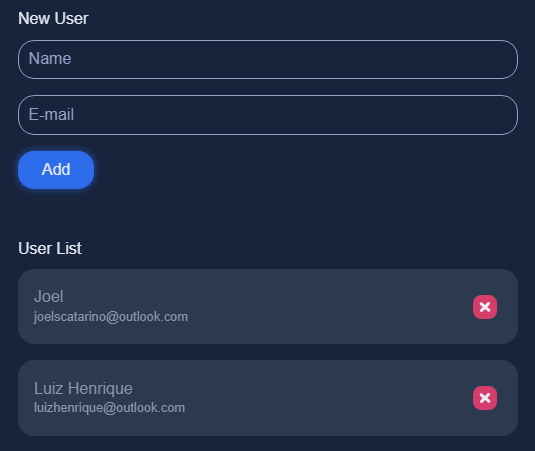

<h1 align="center">
  crud_login_vue
</h1>

  

 

## 🚀 Tecs

- HTML
- CSS
- JavaScript
- TypeScript
- Vue.js
- Node.js
- Express

## 💻 Project

this is a Login Simulator tht allows to register a new user and delete a user
